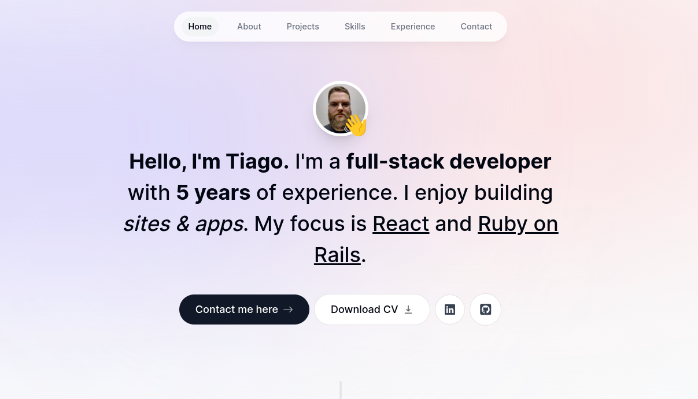

# My Portfolio - A Next.js Project



Welcome to my GitHub repository for My Portfolio, a Next.js project that showcases my skills, experience, and projects. This modern, responsive website is built with React, Tailwind CSS, and TypeScript. It incorporates several cutting-edge features and libraries, including client and server components, context API, animations using Framer Motion, email handling with React Email and Resend, custom React hooks, and a fresh, modern UI design that supports both light and dark modes.

## Table of Contents

1. [Features](#features)
2. [Technologies Used](#technologies-used)
3. [Getting Started](#getting-started)
4. [Installation](#installation)
5. [Usage](#usage)
6. [Contributing](#contributing)
7. [License](#license)

## Features

- **Client and Server Components:** My portfolio incorporates both client and server components, optimizing performance and providing a smooth user experience.

- **Context API:** I've utilized the Context API to manage global state, making it easier to share data across components.

- **Framer Motion Animations:** To add a touch of interactivity and visual appeal, animations are implemented using Framer Motion.

- **Email Handling with React Email and Resend:** The project demonstrates the usage of React Email and Resend for handling email interactions.

- **Custom React Hooks:** I've created custom React hooks to encapsulate and reuse logic efficiently.

- **Fresh and Modern UI Design:** The user interface is designed to be fresh and modern, ensuring an engaging user experience.

- **Light and Dark Mode:** The website supports both light and dark modes, allowing users to choose the appearance that suits them best.

- **Responsive Design:** My portfolio is responsive, providing a seamless experience on a variety of devices and screen sizes.

## Technologies Used

- [Next.js](https://nextjs.org/)
- [React](https://reactjs.org/)
- [Tailwind CSS](https://tailwindcss.com/)
- [TypeScript](https://www.typescriptlang.org/)

## Getting Started

To get started with My Portfolio, follow the instructions below.

### Installation

1. Clone the repository to your local machine:

   ```bash
   https://github.com/tiagorahal/portfolio_2.0.git
   ```

2. Change into the project directory:

   ```bash
   cd portfolio_2.0
   ```

3. Install the project dependencies:

   ```bash
   npm install
   ```

### Usage

To run the development server:

```bash
npm run dev
```

The application should now be accessible at `http://localhost:3000`.

### Contributing

Contributions to this project are welcome. Please follow these guidelines when contributing:

1. Fork the repository.
2. Create a new branch for your feature or bug fix: `git checkout -b feature/your-feature`.
3. Commit your changes with descriptive commit messages.
4. Push your changes to your fork: `git push origin feature/your-feature`.
5. Create a pull request against the `main` branch of this repository.

### License

This project is licensed under the [MIT License](LICENSE.md).

Feel free to explore the code, use it as a reference for your own portfolio, and let me know if you have any questions or feedback. Thank you for visiting my portfolio!